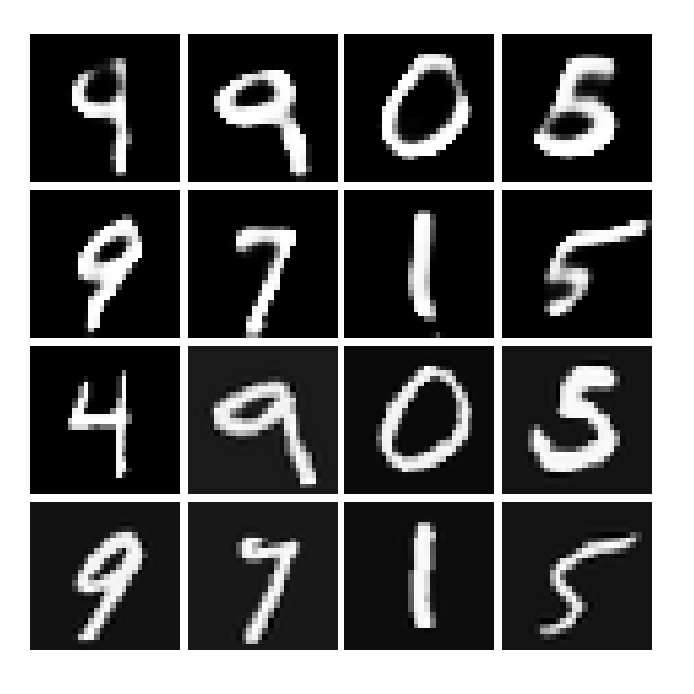
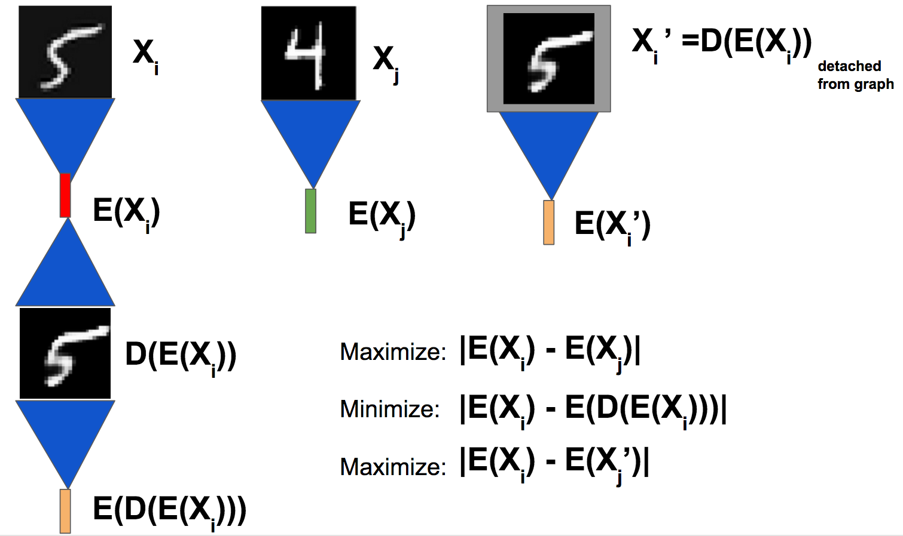

## Encoder-decoder networks: an autoencoder/GAN variant trained by comparing the latent representations of the original and generated inputs

Samples of the original digits (bottom two rows) and the encoded-and-then-decoded versions of the digits (corresponding images in the top two rows). Not too bad, eh!

## How GANs and autoencoders differ from the encoder-decoder network

In an autoencoder the loss is defined by comparing the original input to a reconstruction of that input. The idea with the encoder-decoder network is to do this comparison in a latent vector space instead of in the input space. 

Like GANs and autoencoders, the encoder-decoder network consists of an encoder and a decoder. In a GAN, the encoder works exclusively as discriminator, deciding whether an input is from the training set or it is faked by the generator. In the encoder-decoder network, the idea is to train a decoder to generate items from a vector while simultaneously training an encoder which can discriminate generated images from real ones and which can encode enough essential information about the input that the generator can reconstruct the input from the latent vector.

## How the encoder-decoder network works

The encoder-decoder network works by encoding an input, `X`, into a vector `E(X)`, decoding the vector back into the input space, `D(E(X)`, then finally re-encoding the result back into a vector, `E(D(E(X)))`. The goal is to use a contrastive loss to minimize the difference between the first encoding, `E(X)`, and the second encoding, `E(D(E(X)))`. At the same time, we want to maximize the distance between the encodings of two different inputs, `E(X1)` and `E(X2)`. 

The third contribution to the loss is the one that gives the encoder capabilities as a discriminator. It's also a bit tricky to understand, so please be patient with yourself and my explaination! The idea is to take `X' = D(E(X))` and "chop off the graph": now when we show `X'` to the encoder, we want the encoder to see that `X'` is a generated image: in other words, we want to maximize the distance between `E(X')` and `E(X)`. What "chopping the graph off" means mathematically here is that the back-propagation operations performed to maximize the distance between `E(X')` and `E(X)` will only update the encoder when the back-prop algorithm takes the derivative of `E(X')`. This trick is what allows the encoder to learn to serve as a discriminator.

So the loss for the encoder-decoder network has three (contrastive) terms: one minimizing `E(D(E(X))) - E(X)`, one maximizing `E(X1) - E(X2)` and one maximizing `E(X') - E(X)`. For the MNIST data set, the prettiest-looking images are obtained when the contribution of the third term is increased by a factor of 2.0. It's not clear to me at the moment why this value is optimal or whether tuning this parameter might lead to improved results in other input spaces.

## Advantages of the encoder-decoder network
One challenge with GANs is that the loss function doesn't serve as a good indicator of whether the algorithm is continuing to improve. The loss function in the encoder-decoder network also exhibits similar behaviour. However, as the encoder and decoder train, the length of the latent vectors first drops to 0 before slowly increasing to an equilibrium. At this equilibrium the subjective quality of the generated images does not seem to improve.  The equilibrating length of the latent vectors in the encoder-decoder is a useful metric which indicates when the algorithm is no longer improving.

An advantage of the encoder-decoder network over autoencoders is that the loss function does not need to incorporate details about the data types in the input. Autoencoders make the most sense when the input data is all the same type (pixel values, for instance), but makes less sense when the input contains multiple data types: it's not reasonable to compare the mean-square error in the reconstruction of a categorical variable to the mean-square error in the reconstruction of a continuous variable. By doing  

## Further work
Adding a variational component to the encoder network made the subjective quality of the generated images worse. It seems likely that the encoder learns to use some dimensions to keep track of how "fake" an image is while other dimensions are used to store information about features useful for reconstructing the image. Perhaps the algorithm is misled to generate fake-looking images when the variational component moves the vector into a part of phase space where the encoder has learned to place faked images.

One advantage of the encoder-decoder network is that it need not work only with continuous data. Because the `E(X') - E(X)` term explicitly detaches a generated item from the graph, continuous-valued predictions for discrete points can also be "repaired" to the closest discrete point.  

 